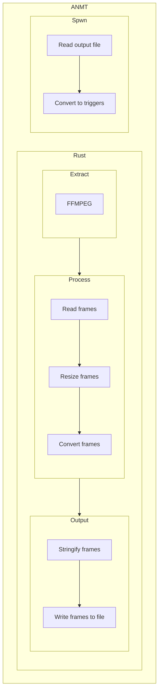

# ANMT

Videos to Geometry Dash level converter!

## Disclaimer

| You're responsible for your own actions.
|-
| The developers of this project aren't in charge for the end-users' actions.

## How does ANMT work?



## Setup

### Self-build

You will require the following software to be installed on your machine before continuing:

- [ ] [Rust](<https://www.rust-lang.org/>)
- [ ] [FFmpeg](<https://www.ffmpeg.org/download.html>)
  - [ ] add FFmpeg to the environment variables
- [ ] [SPWN](<https://github.com/spu7Nix/SPWN-language/releases>)

## Load images

In the current folder, create a new folder named `videos/`.
In that folder, add the videos you want to process.

Note: The longer the videos are, the longer it will take to process and compile them.

## Process images

Run `cargo run --release` and wait until it's done.
This will extract all the frames from your video and will create a new file in `videos/output/`.

## Compile into Geometry Dash

Check out `videos/output/`, and look for the file you generated.
Edit the parameter `filename` in `example.spwn` to the path of the file you want to compile.
Now you can run `spwn build example.spwn --allow readfile`, and slowly but surely it will build your video to your latest Geometry Dash level.

## FAQ

### How do I make the program stop processing a file in the `videos/` folder?

Create a sub-folder put the video there.
Otherwise, you can delete it, or move it to a different folder.

## Supported video/animation formats

- [x] mp4
- [x] avi
- [x] mov
- [x] wmv
- [x] flv
- [x] gif
- [x] apng

```cmd
ffmpeg -formats
```

Other formats that are demuxing-supported by FFmpeg can be added to the list.
